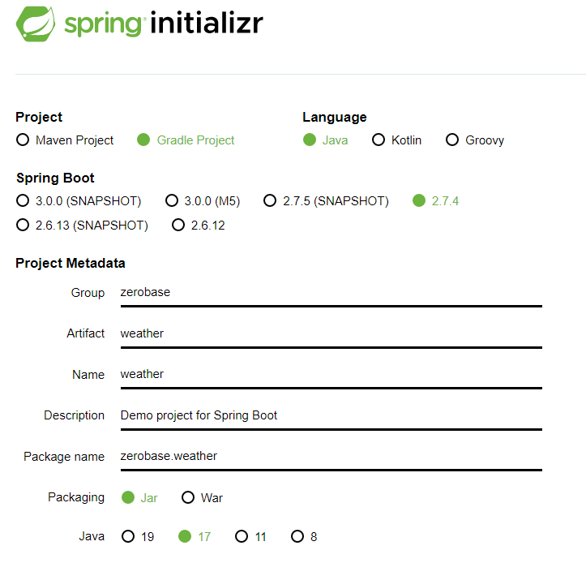
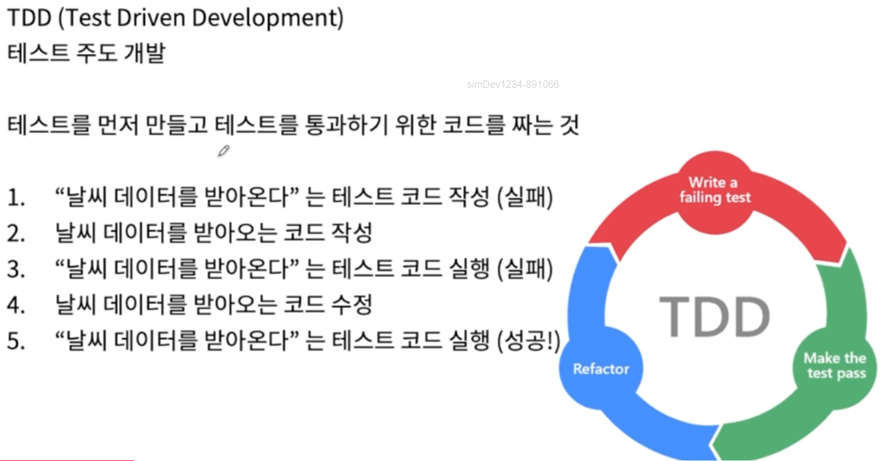
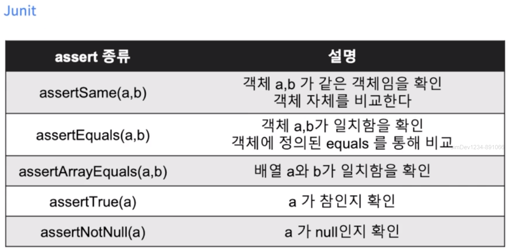

# Weather
하루 기록 앱 '하루콩'처럼 하루의 날씨와 일기를 기록하는 서비스

## 개요
    주제 : 하루 기록 앱 '하루콩'처럼 하루의 날씨와 일기를 기록하는 앱

## 데이터를 불러오기
    데이터를 불러오는 방법
      1) 크롤링 
         [합법적인 웹 크롤링] https://yozm.wishket.com/magazine/detail/877/
         [웹 크롤링 방법] t.ly/BlAU
      2) Open API : 공공데이터 포털, 그 외 api 제공 사이트

    공개된 API 고르는 방법
      1) API document 참고하기
      2) API가 다루는 데이터 범위 알아보기

## 프로젝트 만들기
    1) Maven/Gradle : 빌드 도구
    2) Spring Boot 
    - Spring Framework의 핵심 기능 : 
       (1) IoC (원칙) : 프로그램 흐름에 대한 제어권이 개발자가 아닌 프레임워크에게 있다.
       (2) DI (디자인 패턴) : 의존성을 주입 함으로 객체 간 결합을 느슨하게 하는 것 (rf. DiscountInterface의 구현제 주입)
       (3) AOP (개발 방법론) : 관점 지향 프로그래밍을 말한다. 핵심이 되는 비즈니스 로직 + 부가적인 로깅 등 
       (4) Resource, AOP, Validation, SqEL
    - Spring Framework를 사용하기 쉽게 상용화한 것을 Spring Boot라고 한다. 
    3) Jar는 자바 아카이브를 의미하며, War는 여기에 웹 관련 자원(html, javascript등)을 포함한다.
    4) JDK 1.8 버전 * LTS (Lont-term-support) : 8, 11, 17 버전 

## TDD (Test Driven Development)

## JUnit을 통한 단위테스트

    