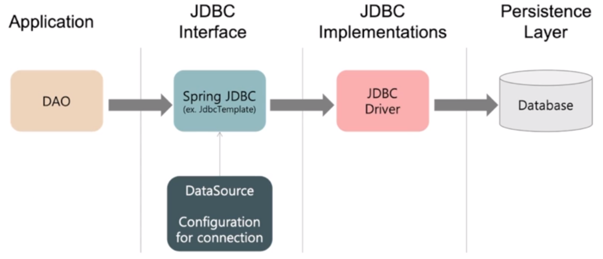
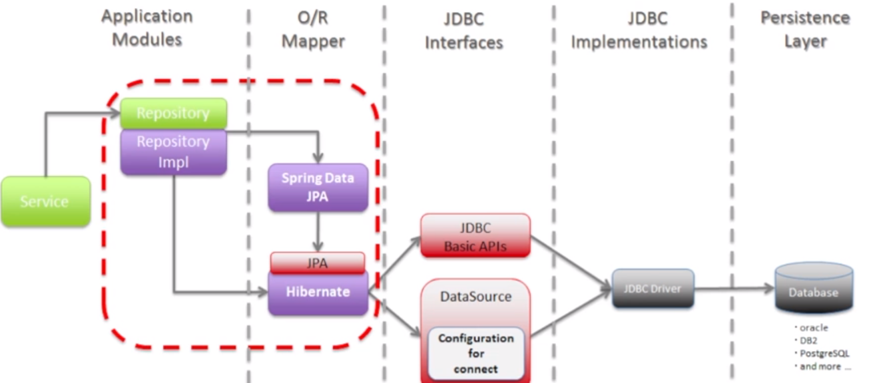

# ORM 개념
 
1. Persistence(영속성) : 데이터를 생성했던 프로그램이 종료되더라도 데이터는 없어지지 않는 것    
    ㄴ DBMS를 사용해야 한다는 의미  
2. Persistence Framework : DB와의 연동되는 시스템을 빠르게 개발하고, 안정적인 구동을 보장해주는 프레임워크    
    ㄴ 종류 : 1) SQL Mapper 2) ORM
    ㄴ 장점 : 재사용 및 유지보수 용이(DBMS에 의존적이지 않음), 직관적인 코드 

| 구분  | SQL Mapper                           |ORM(Object Relation Mapping)|
|-----|--------------------------------------|---|
| 내용  | SQL를 개발자가 직접 작성                      |Object와 DB테이블을 매핑   java함수를 사용하면 자동으로 SQL이 만들어짐|
| 매핑  | 쿼리 수행 결과<->객체                   | DB테이블<->객체|
| 단점  | DB 종류 변경 시 쿼리 수정 필요   비슷한 쿼리 반복작성 | 복잡한 쿼리를 자바 메서드만으로 해결하는 것이 불편함 |

<code>정리</code>   
- Persistence(영속성)은 프로그램 종류 후에도 데이터가 영속적으로 남아있는 것을 의미한다.
- Persistence Framework는 프로그램과 DB를 매핑시켜주는 프레임워크를 말하며, 크게 1) SQL Mapper 2) ORM으로 나뉜다. 
- SQL Mapper는 DBMS 종류에 맞춰 개발자가 직접 쿼리문을 작성해야 하지만,    
  ORM은 DBMS 종류와 상관없이 자바 객체와 DB 테이블이 매핑시킬 수 있어 상대적으로 DB 종류에 덜 의존적이다.

# JPA vs JDBC 
- JPA는  ORM의 한 종류이다.  
- JDBC는 SQL mapper의 한 종류이다.    
  
- JDBC : Java Database Connectivity

- JPA : Java Persistence API

# DB
- DB는 다양한 종류들이 있다. 상황에 따라 적합한 DB를 사용하는 능력을 기르도록 하자.
- RDMBS : MySQL, PostgreSQL 등
- NoSQL : Redis 등

# Annotation
1. @Transactional 
   - 일반적으로 Business Logic Layer(Service)에서 사용하는 Annotaion으로,
   - EntityManager에 의해 begin(), commit(), rollback() 되어지는 흐름을 말한다.
   - 디폴트로는 지연로딩을 사용하며, 이 경우 별도의 연관 객체를 통해 일괄적으로 flush()가 이루어진다.
   - [주의할 점] 테스트 영역에서 사용할 경우, db에 영향을 미치지 않는다. (롤백되어 돌아온다.)
2. @Entity 와 @Table
    - DBMS에 저장되어 있는 테이블은 여러 개의 @Entity와 연결 될 수 있다.
    - @Entity가 들어간 객체는 용도에 따라서 테이블의 칼럼 하나 이상을 담을 수 있으며,
    - @Entity(name = "Tablename") 과 같이 테이블의 이름을 지정해줄 수 있다.
    - 또는 @Table(name = "Tablename") 을 엔터티 역할을 하는 클래스에 적어주는 것을 대체할 수 있다.
3. @GeneratedValue
    - GenerationValue.AUTO : 상황에 맞게 알아서 설정하라
    - GenerationValue.IDENTITY : Id 설정을 DB의 테이블에게 맞기겠다. (이미 키 값이 있는 경우 그걸 가져온다.)
    - GenerationValue.SEQUENCE : db object를 만들어 키 생성을 한다.
    - GenerationValue.TABLE : 테이블 키 생성을 한다.